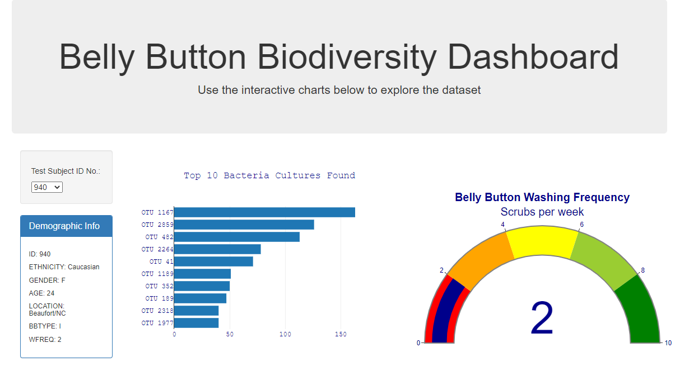
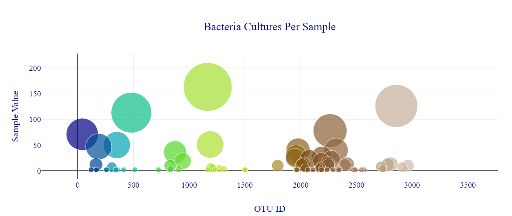

# Belly Button Biodiversity Dashboard

**Interactive Dashboard link**: https://azeledon.github.io/plotlydiploy/

## Overview
The purpose of this project is to create an interactive dashboard that allows the user to explore belly button biodiversity dataset, which catalogs the microbes that colonize human navels. The dataset reveals that a small handful of microbial species (also called operational taxonomic units, or OTUs, in the study) were present in more than 70% of people, while the rest were relatively rare.

